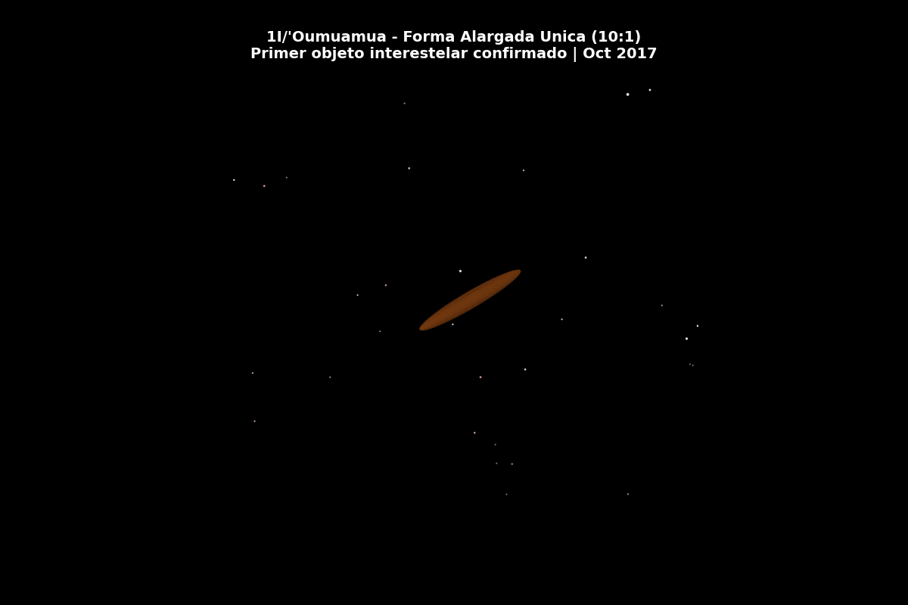

<p align="center">
  
</p>

<h1 align="center">i3 Atlas</h1>
<h3 align="center">Deep Learning vs Machine Learning sobre Datos Astronomicos Reales</h3>
<p align="center">
  Analisis comparativo con Apache Spark de los 3 objetos interestelares del Sistema Solar
</p>

<p align="center">
  <a href="https://todoeconometria.github.io/i3altlas-todoeconometria/"><strong>Ver Web del Proyecto</strong></a>
  &nbsp;&middot;&nbsp;
  <a href="https://todoeconometria.github.io/i3altlas-todoeconometria/dashboard.html"><strong>Dashboard Interactivo</strong></a>
  &nbsp;&middot;&nbsp;
  <a href="https://todoeconometria.com">todoeconometria.com</a>
</p>

<p align="center">
  
</p>

---

## Los 3 Visitantes Interestelares

| Objeto | Descubierto | Perihelio | Velocidad | Origen |
|--------|-------------|-----------|-----------|--------|
| **1I/'Oumuamua** | Oct 2017 | 0.255 AU | 26.3 km/s | Direccion de Vega |
| **2I/Borisov** | Ago 2019 | 2.007 AU | 32.2 km/s | Casiopea |
| **3I/ATLAS** | Jul 2025 | 1.35 AU | 60 km/s (220,000 km/h) | Centro galactico |

Son los unicos objetos confirmados que provienen de fuera del Sistema Solar. Sus trayectorias hiperbolicas (excentricidad > 1) los distinguen de cualquier otro cuerpo conocido.

## Que hace este proyecto

Pipeline completo de 7 pasos que compara **Machine Learning clasico** vs **Deep Learning** sobre datos astronomicos reales:

```
1. Adquisicion    -> APIs JPL (NASA) + SDSS (50,000+ objetos)
2. ETL Spark      -> Limpieza distribuida + Feature Engineering
3. ML Tradicional -> Random Forest, SVM, XGBoost, Isolation Forest
4. Deep Learning  -> DNN, Autoencoder, 1D-CNN (TensorFlow/Keras)
5. Benchmark      -> Metricas comparativas: precision vs tiempo
6. Dashboard      -> 8 pestanas Plotly interactivas
7. Animaciones    -> GIFs cinematicos de trayectorias hiperbolicas
```

## Comparativa ML vs DL

| Aspecto | Deep Learning | ML Tradicional |
|---------|---------------|----------------|
| **Procesamiento** | End-to-end, redes neuronales | Extraccion manual de features |
| **Precision** | Alta para tareas complejas | Limitada por features manuales |
| **Requisitos** | GPU, mas datos, mas tiempo | CPU, menos recursos |
| **Interpretabilidad** | Caja negra (limitada) | Alta (feature importance) |
| **Escalabilidad** | Escala con datos y compute | Limitada por algoritmo |
| **Caso ideal** | Deteccion de anomalias complejas | Clasificacion con features claras |

## Animaciones

<table>
<tr>
<td></td>
<td></td>
</tr>
<tr>
<td align="center"><b>Viaje de 3I/ATLAS</b><br><sub>220,000 km/h desde el centro galactico</sub></td>
<td align="center"><b>'Oumuamua: Forma 10:1</b><br><sub>Primer visitante interestelar</sub></td>
</tr>
</table>

## Fuentes de Datos Reales

| Fuente | Datos | API |
|--------|-------|-----|
| **JPL Small-Body Database** | 50,000+ asteroides/cometas | `ssd-api.jpl.nasa.gov` |
| **JPL Horizons** | Efemerides de 'Oumuamua y Borisov | `astroquery.jplhorizons` |
| **SDSS Galaxy Colors** | 50,000 galaxias: colores u-g, g-r, r-i, i-z | `astroML.datasets` |

## Dashboard (8 pestanas)

| Pestana | Contenido |
|---------|-----------|
| **Interestelares** | Los 3 visitantes: trayectorias 3D, velocidades, perihelios |
| **Exploracion 3D** | Scatter 3D de orbitas con filtros por tipo |
| **Animaciones** | GIFs cinematicos embebidos |
| **ML: Clasificacion** | Metricas RF, SVM, XGBoost + feature importance |
| **DL: Clasificacion** | Loss curves DNN + comparativa directa |
| **Anomalias ML** | PCA 3D + Isolation Forest |
| **Anomalias DL** | Autoencoder reconstruction error |
| **Benchmark** | Precision vs tiempo: ML vs DL |

## Ejecucion

```bash
# 1. Instalar dependencias
pip install -r requirements.txt

# 2. (Opcional) Cluster Spark
docker compose -f docker-compose-spark.yml up -d

# 3. Ejecutar pipeline completo
python main.py

# O modulos individuales
python data_acquisition.py        # Solo datos
python ml_traditional.py          # Solo ML
python deep_learning_pipeline.py  # Solo DL (requiere TensorFlow)
python export_dashboard_html.py   # Solo dashboard
```

## Feature Engineering Astronomico

| Feature | Formula | Significado |
|---------|---------|-------------|
| `tisserand_j` | T_J = a_J/a + 2cos(i)sqrt(a/a_J * (1-e^2)) | Parametro de Tisserand respecto a Jupiter |
| `v_inf` | sqrt(\|1/a\|) * 29.78 km/s | Velocidad en el infinito (hiperbolicas) |
| `energy_param` | -1/(2a) | Energia orbital especifica |
| `q_over_a` | q/a | Ratio perihelio/semieje (circularidad) |

## Stack Tecnologico

| Componente | Version |
|------------|---------|
| Apache Spark | 3.5.4 (cluster Docker) |
| TensorFlow | 2.12+ (GPU opcional) |
| scikit-learn | 1.2+ |
| XGBoost | 1.7+ |
| Plotly | 5.14+ |
| Python | 3.9+ |

## Arquitectura

```
i3atlas-todoeconometria/
├── config.py                    # Configuracion central
├── main.py                      # Orquestador del pipeline
├── data_acquisition.py          # Descarga datos reales (JPL, SDSS)
├── spark_etl.py                 # ETL distribuido con Apache Spark
├── ml_traditional.py            # ML: RF, SVM, XGBoost, Isolation Forest
├── deep_learning_pipeline.py    # DL: DNN, Autoencoder, 1D-CNN
├── benchmark_comparison.py      # Metricas comparativas ML vs DL
├── export_dashboard_html.py     # Dashboard Plotly (8 pestanas)
├── animation_trajectories.py    # Animaciones de trayectorias
├── animation_cinematic.py       # Animaciones cinematograficas
├── requirements.txt             # Dependencias
├── docs/                        # Web del proyecto (GitHub Pages)
│   ├── index.html               # Landing page
│   ├── dashboard.html           # Dashboard interactivo
│   └── assets/                  # GIFs y recursos
└── output/                      # Resultados (auto-generado)
```

---

<p align="center">
  
</p>
<p align="center">
  <b>Big Data con Python - De Cero a Produccion</b><br>
  Prof. Juan Marcelo Gutierrez Miranda | <a href="https://github.com/TodoEconometria">@TodoEconometria</a><br>
  <a href="https://todoeconometria.com">todoeconometria.com</a>
</p>

**Referencias academicas:**
- Tonry, J. L., et al. (2018). ATLAS: A High-cadence All-sky Survey System. *PASP*, 130(988), 064505.
- Meech, K. J., et al. (2017). A brief visit from a red and extremely elongated interstellar asteroid. *Nature*, 552, 378-381.
- Goodfellow, I., Bengio, Y., & Courville, A. (2016). *Deep Learning*. MIT Press.
- Pedregosa, F., et al. (2011). Scikit-learn: Machine Learning in Python. *JMLR*, 12, 2825-2830.
- Zaharia, M., et al. (2016). Apache Spark: A Unified Engine for Big Data Processing. *CACM*, 59(11), 56-65.
- Chen, T., & Guestrin, C. (2016). XGBoost: A Scalable Tree Boosting System. *KDD '16*, 785-794.
- Liu, F. T., et al. (2008). Isolation Forest. *IEEE ICDM*, 413-422.
- LeCun, Y., et al. (2015). Deep learning. *Nature*, 521(7553), 436-444.
- Murray, C. D., & Dermott, S. F. (1999). *Solar System Dynamics*. Cambridge University Press.
